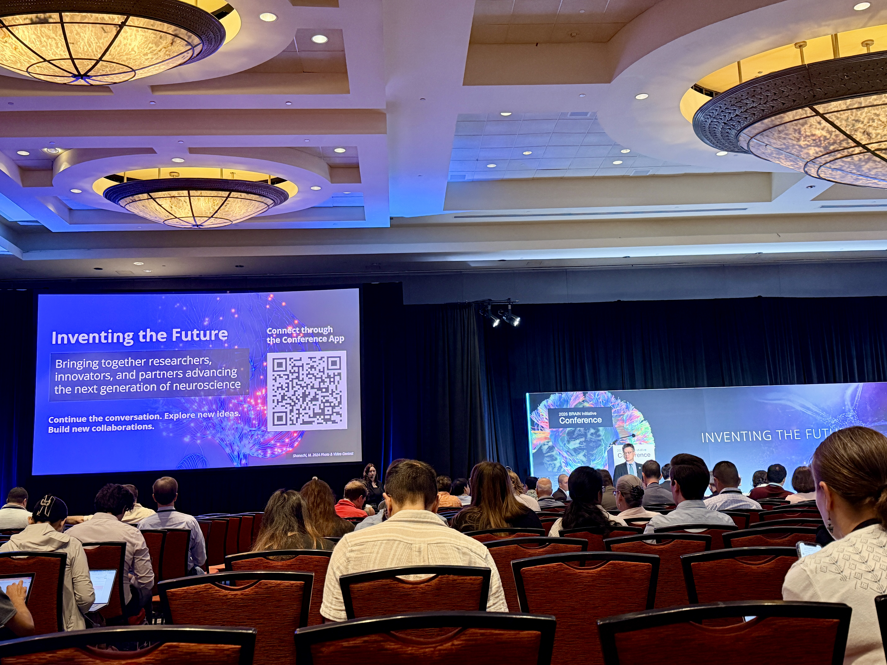
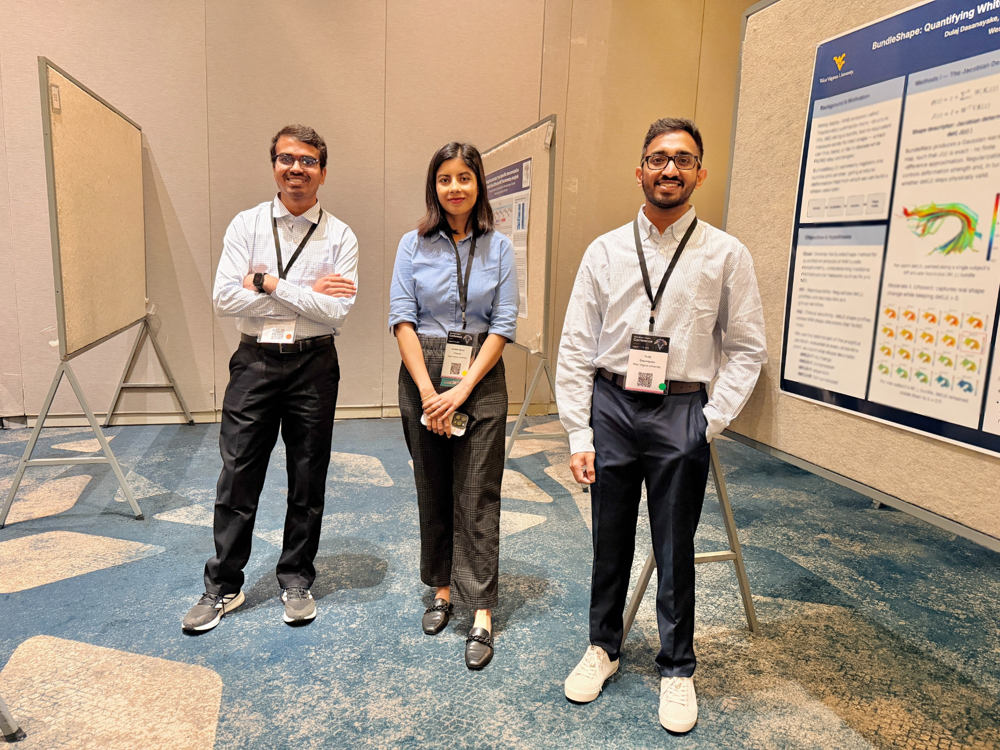

Members of the BMN Lab attended the [2026 NIH BRAIN Initiative Conference](https://www.nih.gov/brain/events/2026-brain-initiative-conference), held **August 11–13, 2026** at the **Bethesda North Marriott Hotel & Conference Center** in the Washington, D.C. area (Rockville, Maryland).

### About the conference
The BRAIN Initiative Conference is the annual gathering of the NIH Brain Research Through Advancing Innovative Neurotechnologies® community. It brings together grant awardees, NIH staff, and leaders from the Initiative's federal and non-federal partners to share the latest scientific developments and discuss research priorities for technology-driven neuroscience.

We presented two posters:

- **C094** – AlongTractComBat: Tract-specific harmonization for multi-site diffusion MRI tractometry analysis
- **C095** – BundleShape: Quantifying white matter morphology using nonlinear bundle registration

