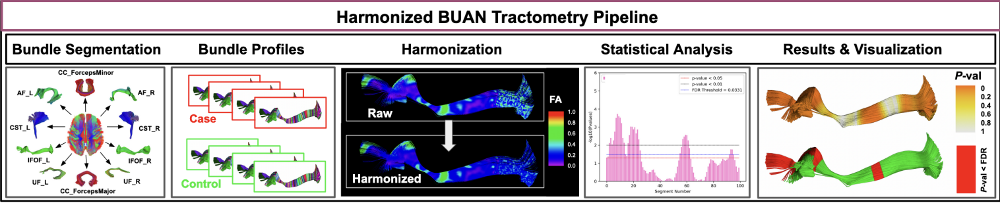

**Harmonized BUAN** extends the Bundle ANalytics (BUAN) tractometry pipeline by integrating ComBat data harmonization to correct for multi-site and multi-scanner variability. It enables researchers to combine datasets from diverse imaging protocols, maximizing statistical power while mitigating confounding technical factors to ensure the reliable detection of disease effects.

## The Problem

In large-scale neuroimaging research, data must often be pooled across multiple sites to detect subtle disease effects. However, differences in acquisition parameters, such as voxel size, angular resolution, and scanner models, introduce systematic biases (batch effects) that can artificially alter derived microstructural metrics. While harmonization tools like ComBat are widely used at the whole-brain voxel or broad region-of-interest (ROI) level, their application to 3D tractometry, which requires preserving fine-grained, along-tract spatial precision, has remained underexplored.

## Framework Overview

The Harmonized BUAN pipeline integrates batch-effect correction directly into along-tract analysis through four stages:

**1. Bundle Extraction & Profiling** White matter bundles are segmented from whole-brain tractograms, and bundle profiles are created by dividing tracts into 100 segments based on distances to a model bundle centroid. Diffusion metrics (e.g., FA, MD, RD, AD) are then projected along these discrete segments.

**2. Feature Selection Strategy** The framework utilizes a **bundle-wise** feature selection strategy, treating the 100 segments of each distinct bundle type as independent features. This targeted approach preserves the unique spatial characteristics and data distributions of individual pathways better than attempting to harmonize the entire whole-brain tractogram at once.

**3. Segment-Wise Harmonization** An adapted ComBat model is applied point-by-point along the length of the tracts. The model adjusts for biological covariates (like age and sex), and applies an empirical Bayes scale and shift transformation to the residuals to standardize the distributional shifts caused by specific scanning protocols.

**4. Population-Level Statistics** The harmonized bundle profiles are analyzed using linear regression and Linear Mixed Models (LMMs) to map localized group differences. The statistically significant segments are projected back onto 3D tract models for anatomical visualization.

  
  
<em>Harmonized BUAN pipeline: bundle segmentation → along-tract profiling → segment-wise ComBat harmonization → statistical analysis and 3D visualization.</em>

## Applications

The Harmonized BUAN framework has been evaluated to optimize multi-site tractometry studies:

| Study Focus | Finding |
|---|---|
| Multi-Site Alzheimer's Disease (ADNI3) | Applying harmonization significantly boosts the statistical power and sensitivity to detect microstructural group differences between MCI, AD, and healthy controls. |
| Whole-Brain vs. Bundle-Wise Harmonization | Bundle-wise harmonization outperforms whole-brain tractogram-wise approaches by accurately capturing the nuanced variations unique to distinct white matter tracts. |
| Robustness to Bundle Extremities | Pruning the noisy extremities of fiber bundles (a "bundle-core-wise" approach) yields almost identical statistical results to using the full bundle, proving the framework is robust to structural noise at termination points. |

## Validation

Harmonized BUAN was rigorously validated on **730 participants** from the Alzheimer's Disease Neuroimaging Initiative (ADNI3) dataset across **7 distinct scanning protocols**, demonstrating:
- Higher significance (smaller nominal p-values) for group-level disease effects compared to linear regression and LMMs applied to unharmonized data.
- Confirmation that sequentially adding data from diverse acquisition protocols increases overall statistical power.
- Proof that integrating ComBat harmonization successfully mitigates protocol-induced power reductions, further amplifying disease detection sensitivity.

## Publication

Chandio, B. Q., Villalon-Reina, J. E., Nir, T. M., Thomopoulos, S. I., Feng, Y., Benavidez, S., Jahanshad, N., Harezlak, J., Garyfallidis, E., & Thompson, P. M. (2024). **Bundle Analytics based Data Harmonization for Multi-Site Diffusion MRI Tractometry.** *2024 46th Annual International Conference of the IEEE Engineering in Medicine and Biology Society (EMBC)*. [https://doi.org/10.1109/EMBC53108.2024.10782419](https://doi.org/10.1109/EMBC53108.2024.10782419)
