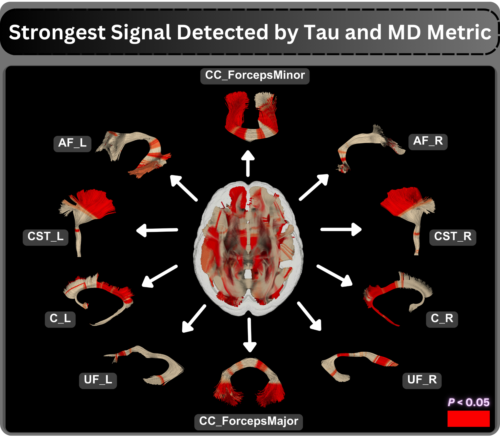
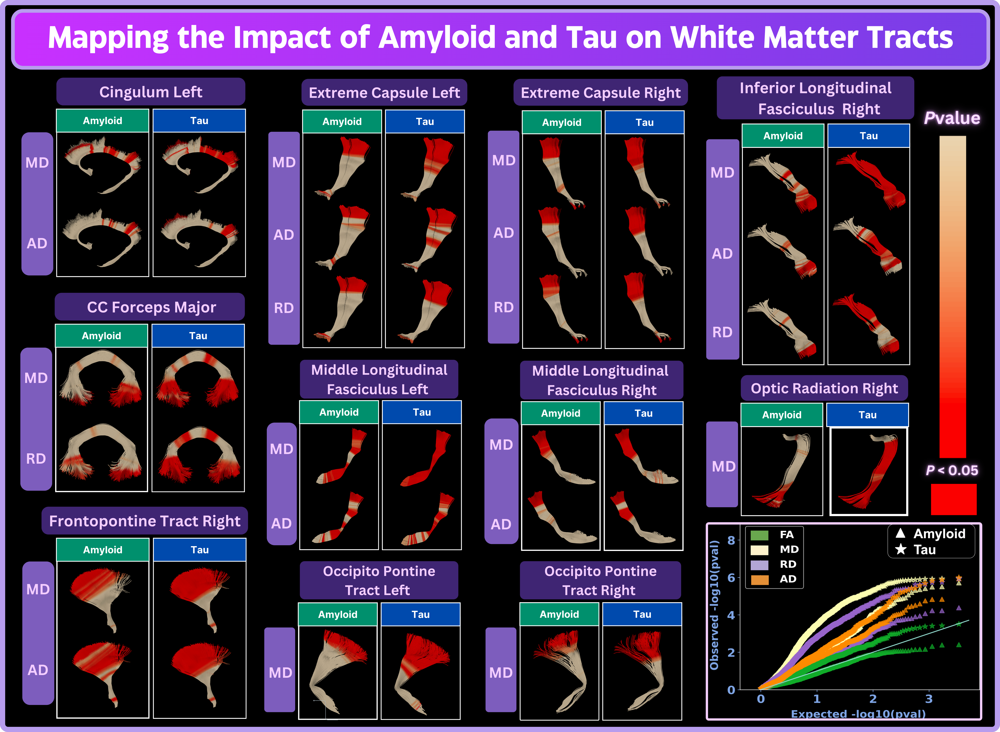

The BMN Lab applies tractometry — fine-grained, along-tract analysis of diffusion MRI — to study white matter changes in neurodegenerative conditions, with a primary focus on **Alzheimer's Disease (AD)**. By combining BUAN tractometry with large multi-site datasets, we map how pathological processes (amyloid deposition, tau accumulation, genetic risk factors) alter the microstructure of specific fiber pathways before and during clinical decline.

## Why Tractometry in Neurodegeneration?

Conventional voxel-based morphometry and ROI-averaged diffusion metrics collapse the rich spatial variation within white matter tracts into single scalar summaries, obscuring the earliest and most localized signs of degeneration. Tractometry preserves along-tract detail, enabling:

- Detection of subtle, spatially restricted microstructural changes preceding diagnosis
- Differentiation of disease effects by tract segment rather than by broad region
- Direct comparison of pathology across large, heterogeneous multi-site cohorts

## Research Directions

### Amyloid, Tau, and APOE Effects on White Matter

We applied BUAN tractometry to 3D diffusion MRI from **730 ADNI3 participants** (cognitively healthy controls, mild cognitive impairment, and AD), examining FA, MD, AxD, and RD across 38 white matter bundles. Key findings:

- **Tau pathology** showed stronger, more widespread associations with white matter microstructure than amyloid burden
- **Mean diffusivity** was the most sensitive DTI metric to AD pathology; FA the least
- **APOE ε4 carriers** exhibited significant microstructural abnormalities relative to ε3/ε3 individuals, pointing toward genotype-informed therapeutic targets

  
  
<em>Along-tract p-value profiles and 3D tract visualizations comparing APOE ε4 vs. ε3 (top) and APOE ε2 vs. ε3 (bottom) white matter microstructural differences across spinothalamic, frontopontine, longitudinal, and uncinate tracts in MD, AxD, and FA.</em>

### Amyloid Vulnerability Across Diverse Populations

In a larger multi-cohort study (**1,908 participants**: ADNI3 + HABS-HD), we investigated which white matter tracts are most vulnerable to amyloid pathology along the AD continuum. Leveraging BUAN across diverse racial and ethnic groups, this work identifies tract-specific biomarkers of early amyloid burden relevant to both detection and intervention.

  
  
<em>BUAN tractometry visualizations of the 10 white matter bundles showing the strongest tau-related microstructural signals detected by mean diffusivity (MD), with red segments indicating significant effects (p < 0.05).</em>

### Hemispheric White Matter Asymmetry in AD

We developed a novel framework combining BUAN tractometry with a **symmetric HCP1065 atlas** to enable segment-wise left–right comparison of homologous fiber pathways. Applied to **1,215 ADNI participants** (ADNI-3 and ADNI-4, 10 acquisition protocols, three scanner vendors), key findings include:

- Asymmetry patterns emerge progressively: selective effects in MCI expand to widespread multi-tract asymmetry in dementia
- The same tracts showing early asymmetry in MCI demonstrate broader, stronger effects in full dementia
- AxD and MD show the strongest group-level distinctions between healthy controls and neurodegenerative populations

  
  
<em>BUAN tractometry maps comparing localized amyloid and tau associations across 10 white matter bundles, with tau showing stronger and more widespread microstructural effects than amyloid across MD, AxD, and RD.</em>

## Publications

Chandio, B. Q., Villalon-Reina, J. E., Nir, T. M., Thomopoulos, S. I., Feng, Y., Benavidez, S., Jahanshad, N., Harezlak, J., Garyfallidis, E., & Thompson, P. M. (2024). **Amyloid, Tau, and APOE in Alzheimer's Disease: Impact on White Matter Tracts.** *bioRxiv*. [https://pmc.ncbi.nlm.nih.gov/articles/PMC11326207/](https://pmc.ncbi.nlm.nih.gov/articles/PMC11326207/)

Chandio, B. Q., et al. (2025). **White Matter Tract Vulnerability to Amyloid Pathology on the Alzheimer's Disease Continuum.** *IEEE ISBI 2025*. [https://ieeexplore.ieee.org/abstract/document/11283325](https://ieeexplore.ieee.org/abstract/document/11283325)

Chandio, B. Q., Feng, Y., Ba Gari, I., et al. (2026). **Tractometry-Based Quantification of Along-Tract White-Matter Hemispheric Asymmetry in Alzheimer's Disease.** *bioRxiv*. [https://pmc.ncbi.nlm.nih.gov/articles/PMC12871689/](https://pmc.ncbi.nlm.nih.gov/articles/PMC12871689/)
