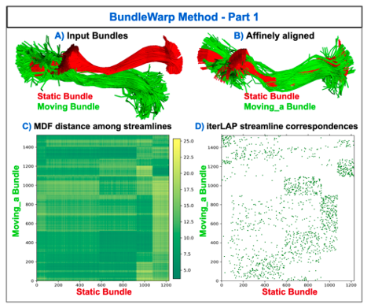
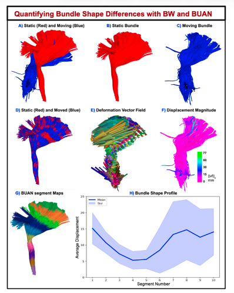

This project develops methods for **nonlinear white matter tract registration** from diffusion MRI. We build on the BundleWarp framework [(Chandio et al., *Medical Image Analysis*, 2026)](https://doi.org/10.1016/j.media.2025.103464) and Bundle Analytics [(Chandio et al., *Scientific Reports*, 2020)](https://doi.org/10.1038/s41598-020-74054-4).

  
  
<em>Chandio et al. 2026, Fig. 1</em>

  
  
<em>Chandio et al. 2026 — Along-tract shape profile from deformation fields.</em>

