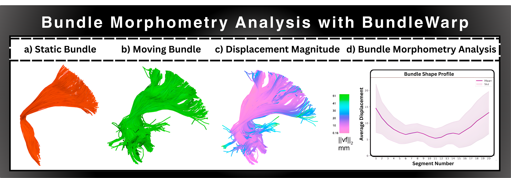

**BundleWarp** introduces a streamline-specific nonlinear registration framework that directly warps white matter fiber bundles while preserving their critical topological features — enabling precise, anatomically faithful alignment across subjects for population-level brain studies.

## The Problem

Existing white matter registration methods rely on image-based transformations (e.g., ANTs) or linear streamline alignment, both of which fail to capture the complex, nonlinear shape differences between individual subjects' fiber bundles. This limits the sensitivity of population-level tractometry and bundle shape analysis.

## Method: Two-Step Pipeline

BundleWarp solves registration in two stages:

**1. iterLAP** — Streamline Correspondence  
Solves a many-to-one assignment problem to find the best matching between streamlines across two bundles — handling the practical reality that bundles from different subjects contain different numbers of streamlines.

**2. mlCPD** — Nonlinear Deformation  
Applies memoryless Coherent Point Drift deformations to individual streamlines. A Gaussian kernel regularization ensures that streamlines move coherently as a group, preserving anatomical topology while achieving full nonlinear alignment.

A controllable regularization parameter **λ** lets users tune the degree of deformation:
- **λ = 0.3–0.5** → partial deformation, preserving native shape (recommended for clinical use)
- **λ < 0.001** → full deformation, maximizing bundle overlap (for shape difference quantification)

  
  
<em>BundleWarp pipeline: input bundles → affine alignment → iterLAP streamline correspondence → mlCPD nonlinear deformation.</em>

## Validation

**Dataset:** 64 subjects (32 healthy controls, 32 Parkinson's disease) from the Parkinson's Progression Markers Initiative (PPMI)  
**Scale:** 1,728 bundle pairs across 27 white matter tract types, each registered to HCP-842 atlas bundles

  
  
<em>BundleWarp morphometry: deformation field magnitudes quantify along-tract shape differences between subjects, enabling fine-grained tractometry and bundle comparison.</em>

## Applications

- **Tractometry** — improved segment-to-segment correspondence for along-tract scalar profiling
- **Bundle shape analysis** — quantify structural differences between subjects using deformation field magnitudes
- **Atlas construction** — build population-specific white matter atlases with better anatomical fidelity
- **Bundle segmentation** — enhance RecoBundles model alignment

## Publication

Published as: **BundleWarp: Enhancing white matter tractometry and morphometry with precise neuronal mapping using streamline-based nonlinear registration.** *Medical Image Analysis*, 2026. [https://doi.org/10.1016/j.media.2026.104114](https://doi.org/10.1016/j.media.2026.104114)

## Code

- **DIPY integration:** [dipy.org](https://docs.dipy.org/stable/examples_built/registration/bundlewarp_registration.html)
- **GitHub (DIPY):** [github.com/dipy/dipy](https://github.com/dipy/dipy)
